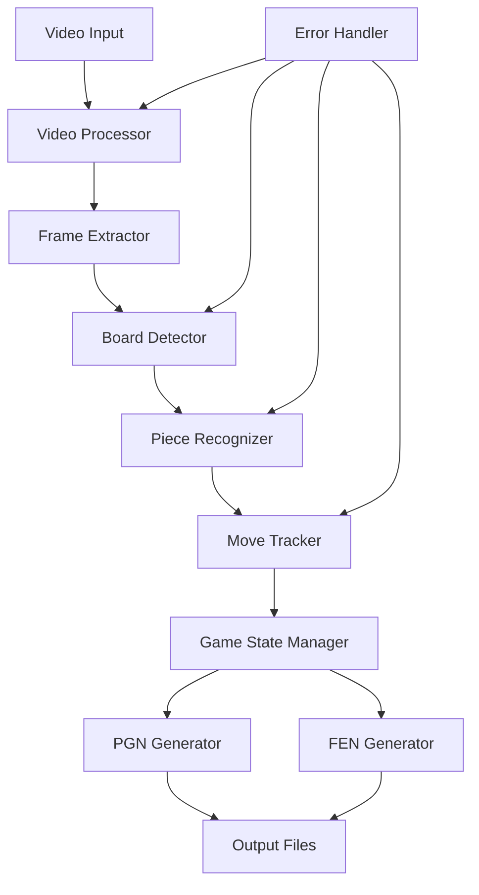

# Design Document: Chess Video Analyzer

## Overview

The Chess Video Analyzer is a computer vision system that processes video recordings of chess games to automatically generate standard chess notation files. The system uses a multi-stage pipeline combining classical computer vision techniques with deep learning to detect the chessboard, recognize pieces, track movements, and generate PGN and FEN outputs.

The system is designed to work with smartphone videos recorded from above the chessboard, handling various lighting conditions, camera angles, and chessboard styles. It processes videos frame-by-frame to build a complete game history and exports results in formats compatible with popular chess platforms.

## Architecture

The system follows a modular pipeline architecture with the following main components:



### Processing Pipeline

1. **Video Processing**: Extract frames at appropriate intervals
2. **Board Detection**: Locate and track the chessboard in each frame
3. **Piece Recognition**: Identify pieces and their positions
4. **Move Tracking**: Detect changes between frames to identify moves
5. **Game State Management**: Maintain current board state and validate moves
6. **Notation Generation**: Create PGN and FEN outputs

## Components and Interfaces

### Video Processor
**Responsibility**: Handle video file input and frame extraction
**Key Methods**:
- `load_video(file_path: str) -> VideoStream`
- `extract_frames(interval: float) -> List[Frame]`
- `get_video_metadata() -> VideoMetadata`

**Implementation Notes**: 
- Uses OpenCV for video processing ([source](https://medium.com/@siromermer/extracting-chess-square-coordinates-dynamically-with-opencv-image-processing-methods-76b933f0f64e))
- Supports MP4, AVI, MOV formats
- Adaptive frame extraction based on motion detection

### Board Detector
**Responsibility**: Detect and track chessboard position and orientation
**Key Methods**:
- `detect_board(frame: Frame) -> BoardRegion`
- `get_square_coordinates(board_region: BoardRegion) -> SquareGrid`
- `determine_orientation(board_region: BoardRegion) -> Orientation`

**Implementation Notes**:
- Uses RANSAC-based algorithm for projective transformation ([source](https://www.researchgate.net/publication/351278729_Determining_Chess_Game_State_From_an_Image))
- Combines Hough line detection with corner detection
- Handles perspective correction and maintains tracking across frames

### Piece Recognizer
**Responsibility**: Identify chess pieces and their positions on the board
**Key Methods**:
- `recognize_pieces(frame: Frame, square_grid: SquareGrid) -> BoardState`
- `classify_piece(square_image: Image) -> PieceType`
- `get_confidence_score(classification: PieceType) -> float`

**Implementation Notes**:
- Uses Convolutional Neural Network (CNN) for piece classification ([source](https://www.researchgate.net/publication/347125306_LiveChess2FEN_a_Framework_for_Classifying_Chess_Pieces_based_on_CNNs))
- Pre-trained model with 92%+ accuracy on piece classification
- Handles different piece styles and lighting conditions

### Move Tracker
**Responsibility**: Track piece movements and detect chess moves
**Key Methods**:
- `detect_move(previous_state: BoardState, current_state: BoardState) -> Move`
- `validate_move(move: Move, game_state: GameState) -> bool`
- `handle_special_moves(move: Move) -> SpecialMove`

**Implementation Notes**:
- Compares consecutive board states to identify changes
- Validates moves against chess rules
- Handles special moves (castling, en passant, promotion)

### Game State Manager
**Responsibility**: Maintain complete game state and move history
**Key Methods**:
- `update_state(move: Move) -> GameState`
- `get_current_position() -> Position`
- `get_move_history() -> List[Move]`
- `validate_game_rules() -> ValidationResult`

**Implementation Notes**:
- Maintains full game history for validation
- Tracks castling rights, en passant possibilities
- Implements chess rule validation

### PGN Generator
**Responsibility**: Generate Portable Game Notation files
**Key Methods**:
- `generate_pgn(game_state: GameState, metadata: GameMetadata) -> str`
- `format_move(move: Move) -> str`
- `add_headers(metadata: GameMetadata) -> str`

**Implementation Notes**:
- Follows PGN specification standard ([source](https://en.wikipedia.org/wiki/Portable_Game_Notation))
- Includes required headers (Event, Site, Date, Round, White, Black, Result)
- Uses standard algebraic notation for moves

### FEN Generator
**Responsibility**: Generate Forsyth-Edwards Notation for each position
**Key Methods**:
- `generate_fen(position: Position) -> str`
- `encode_position(board_state: BoardState) -> str`
- `get_fen_sequence(game_history: List[Position]) -> List[str]`

**Implementation Notes**:
- Follows FEN specification ([source](https://en.wikipedia.org/wiki/Forsyth%E2%80%93Edwards_Notation))
- Includes all six FEN fields: piece placement, active color, castling availability, en passant target, halfmove clock, fullmove number
- Maintains accuracy for position reconstruction

## Data Models

### Core Data Structures

```python
@dataclass
class Position:
    x: int
    y: int

@dataclass
class Square:
    position: Position
    piece: Optional[PieceType]
    
@dataclass
class PieceType:
    color: Color  # WHITE or BLACK
    type: PieceKind  # PAWN, ROOK, KNIGHT, BISHOP, QUEEN, KING

@dataclass
class Move:
    from_square: Position
    to_square: Position
    piece: PieceType
    captured_piece: Optional[PieceType]
    special_move: Optional[SpecialMoveType]
    
@dataclass
class BoardState:
    squares: Dict[Position, Optional[PieceType]]
    timestamp: float
    confidence: float

@dataclass
class GameState:
    current_position: BoardState
    move_history: List[Move]
    castling_rights: CastlingRights
    en_passant_target: Optional[Position]
    halfmove_clock: int
    fullmove_number: int
    active_color: Color

@dataclass
class VideoMetadata:
    duration: float
    fps: float
    resolution: Tuple[int, int]
    format: str

@dataclass
class GameMetadata:
    event: str
    site: str
    date: str
    round: str
    white_player: str
    black_player: str
    result: str
```

### Enumerations

```python
class Color(Enum):
    WHITE = "white"
    BLACK = "black"

class PieceKind(Enum):
    PAWN = "pawn"
    ROOK = "rook"
    KNIGHT = "knight"
    BISHOP = "bishop"
    QUEEN = "queen"
    KING = "king"

class SpecialMoveType(Enum):
    CASTLING_KINGSIDE = "O-O"
    CASTLING_QUEENSIDE = "O-O-O"
    EN_PASSANT = "en_passant"
    PROMOTION = "promotion"

class GameResult(Enum):
    WHITE_WINS = "1-0"
    BLACK_WINS = "0-1"
    DRAW = "1/2-1/2"
    ONGOING = "*"

## Correctness Properties

*A property is a characteristic or behavior that should hold true across all valid executions of a system—essentially, a formal statement about what the system should do. Properties serve as the bridge between human-readable specifications and machine-verifiable correctness guarantees.*

Based on the prework analysis, the following correctness properties have been identified after eliminating redundancy:

### Property 1: Video File Processing
*For any* valid video file in supported formats (MP4, AVI, MOV), the Video_Processor should successfully load and begin processing the file regardless of input method (drag-drop or file dialog)
**Validates: Requirements 1.1, 1.2, 1.4**

### Property 2: Error Handling for Invalid Inputs
*For any* unsupported or corrupted video file, the Video_Processor should return descriptive error messages and handle the error gracefully without crashing
**Validates: Requirements 1.3, 1.5**

### Property 3: Board Detection Robustness
*For any* video frame containing a chessboard, the Board_Detector should identify board boundaries and orientation, even with partial occlusion or slight camera angle changes
**Validates: Requirements 2.1, 2.2, 2.3, 2.4**

### Property 4: Board Detection Interpolation
*For any* sequence of frames where board detection temporarily fails, the Board_Detector should use interpolation from adjacent frames to maintain tracking
**Validates: Requirements 2.5**

### Property 5: Comprehensive Piece Recognition and Move Detection
*For any* frame sequence showing piece movements, the system should correctly identify all pieces, detect source and destination squares, and recognize captures
**Validates: Requirements 3.1, 3.2, 3.3**

### Property 6: Special Move Recognition
*For any* chess game containing special moves (castling, en passant, promotion), the Move_Tracker should correctly identify and classify these moves
**Validates: Requirements 3.4, 3.5, 3.6**

### Property 7: Move Sequence Validation
*For any* complete chess game, the Move_Tracker should produce a chronologically correct sequence of legal moves and detect game endings (checkmate, stalemate)
**Validates: Requirements 4.1, 4.4, 4.5**

### Property 8: Chess Notation Disambiguation
*For any* position with ambiguous moves, the Move_Tracker should apply standard chess notation disambiguation rules correctly
**Validates: Requirements 4.2**

### Property 9: Illegal Move Detection
*For any* sequence containing illegal moves, the Move_Tracker should flag them for user review
**Validates: Requirements 4.3**

### Property 10: PGN Format Correctness
*For any* complete chess game, the PGN_Generator should create valid PGN files with all required headers and correctly formatted moves using standard algebraic notation, including special move notation
**Validates: Requirements 5.1, 5.2, 5.3, 5.4**

### Property 11: PGN Round-trip Validation
*For any* generated PGN file, parsing it should successfully reconstruct the original game data without loss
**Validates: Requirements 5.5**

### Property 12: FEN Generation Completeness
*For any* chess position, the FEN_Generator should create complete FEN strings containing all six required components (piece placement, active color, castling rights, en passant, halfmove clock, fullmove number)
**Validates: Requirements 6.1, 6.2**

### Property 13: FEN Accuracy for Non-standard Positions
*For any* non-standard starting position, the FEN_Generator should accurately represent the position
**Validates: Requirements 6.3**

### Property 14: Game State Tracking Accuracy
*For any* chess game, the FEN_Generator should maintain accurate castling rights and en passant possibilities throughout the game
**Validates: Requirements 6.4, 6.5**

### Property 15: Confidence-based Quality Control
*For any* piece recognition with low confidence scores, the system should flag uncertain moves for user review
**Validates: Requirements 7.2**

### Property 16: Manual Correction Capability
*For any* detected error, the system should allow users to manually correct the error and update the game state accordingly
**Validates: Requirements 7.4**

### Property 17: Output Validation
*For any* export operation, the system should validate output files before saving to ensure they meet format specifications
**Validates: Requirements 7.5**

### Property 18: User Interface Responsiveness
*For any* processing operation, the system should display progress indicators and allow user interaction for review and correction
**Validates: Requirements 8.2, 8.3, 8.4, 8.5**

## Error Handling

The system implements comprehensive error handling at multiple levels:

### Video Processing Errors
- **Unsupported formats**: Return descriptive error messages with supported format list
- **Corrupted files**: Graceful degradation with partial processing where possible
- **File access errors**: Clear error messages with troubleshooting suggestions

### Computer Vision Errors
- **Board detection failures**: Fallback to interpolation from adjacent frames
- **Low confidence recognition**: Flag uncertain detections for manual review
- **Tracking loss**: Re-initialize detection algorithms and notify user

### Chess Logic Errors
- **Illegal moves**: Flag for user review with explanation of rule violation
- **Ambiguous positions**: Apply standard disambiguation rules automatically
- **Game state inconsistencies**: Validate against chess rules and highlight conflicts

### Export Errors
- **File write failures**: Retry with alternative locations and notify user
- **Format validation failures**: Provide detailed error reports with correction suggestions
- **Incomplete data**: Allow partial exports with warnings about missing information

## Testing Strategy

The testing approach combines unit testing for specific scenarios with property-based testing for comprehensive coverage:

### Unit Testing
- **Specific examples**: Test with known chess games and positions
- **Edge cases**: Test boundary conditions (empty boards, single pieces, etc.)
- **Error conditions**: Test with deliberately corrupted or invalid inputs
- **Integration points**: Test component interfaces and data flow

### Property-Based Testing
- **Universal properties**: Verify correctness properties across randomized inputs
- **Comprehensive coverage**: Test with generated chess positions and move sequences
- **Minimum 100 iterations**: Each property test runs at least 100 randomized cases
- **Tagged tests**: Each property test references its design document property

**Property Test Configuration**:
- Use chess-specific generators for valid positions and moves
- Generate edge cases (promotions, castling, en passant) with appropriate frequency
- Test with various video qualities and camera angles
- Validate round-trip properties for PGN and FEN formats

**Test Tag Format**: **Feature: chess-video-analyzer, Property {number}: {property_text}**

The dual testing approach ensures both concrete correctness (unit tests) and general robustness (property tests), providing confidence in the system's reliability across diverse real-world scenarios.
```